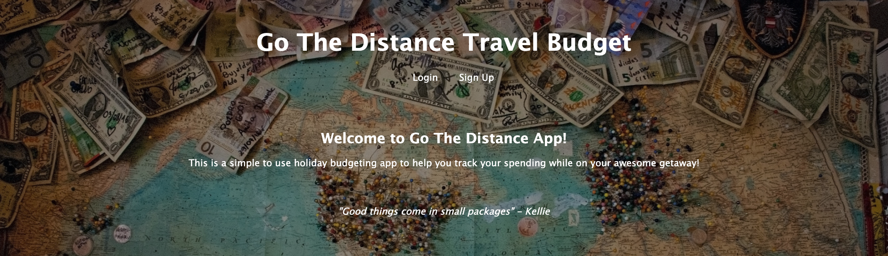
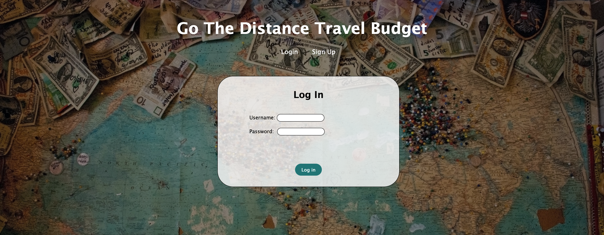
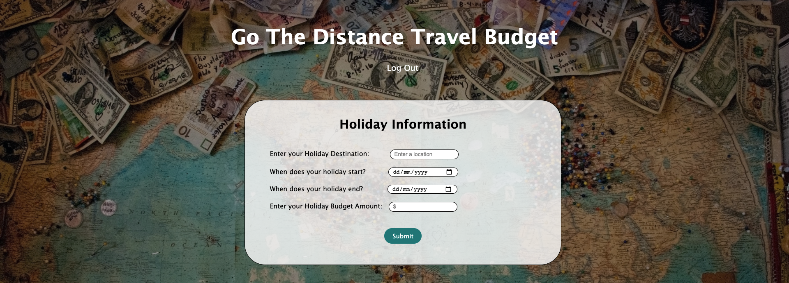
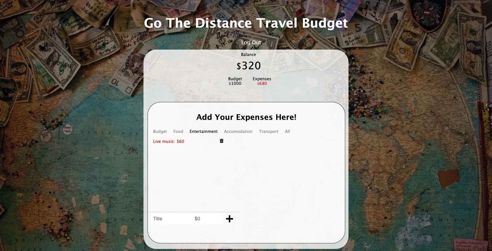
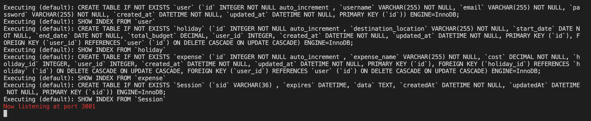

# Go The Distance Budgeting App# Go The Distance


## Description

Go The Distance is a budgeting application for the budget traveller that wants to make the most out their holiday budget and help keep an eye on their expenses while on holiday.

This allows the user to enter a destination, start date, end date and budgeted amount then as they are holidaying they can add their expenses to a table.

The following technologies were used to create this application

- MySQL
- Express.JS
- Node.JS
- Handlebars
- Sequelize
- Chalk
- Bycrpt

## Table of Contents

- [Installation](#installation)
- [Usage](#usage)
- [Application](#application)
- [Resources](#resources)
- [References](#references)
- [Questions](#questions)

## Installation

```
npm install
```

## Application

Homepage


Sign Up


Log In


Add Holiday Details


Holiday expense details


Chalk NPM package


### Resources

- [User story map](https://miro.com/app/board/o9J_lK4fXWo=/)

- [Presentation slides](https://docs.google.com/presentation/d/1Q0ZsjC-rNou6aM7Jb8ilbUmEwDwoUqzMH1R82ahSjQ8/edit?usp=sharing)

### References

The following Youtube video was used to create the code for the holiday expenses

- [Budget App in JavaScript](https://www.youtube.com/watch?v=SQbCwfGC7EM)

## Questions

If you have any questions or would like to report and issue please contact any of the creators [Kellie Adams](https://github.com/Kel03-byte) , [Jacob Thomas](https://github.com/JacobxThomas) and [Elise Harman](https://github.com/harmane4)
